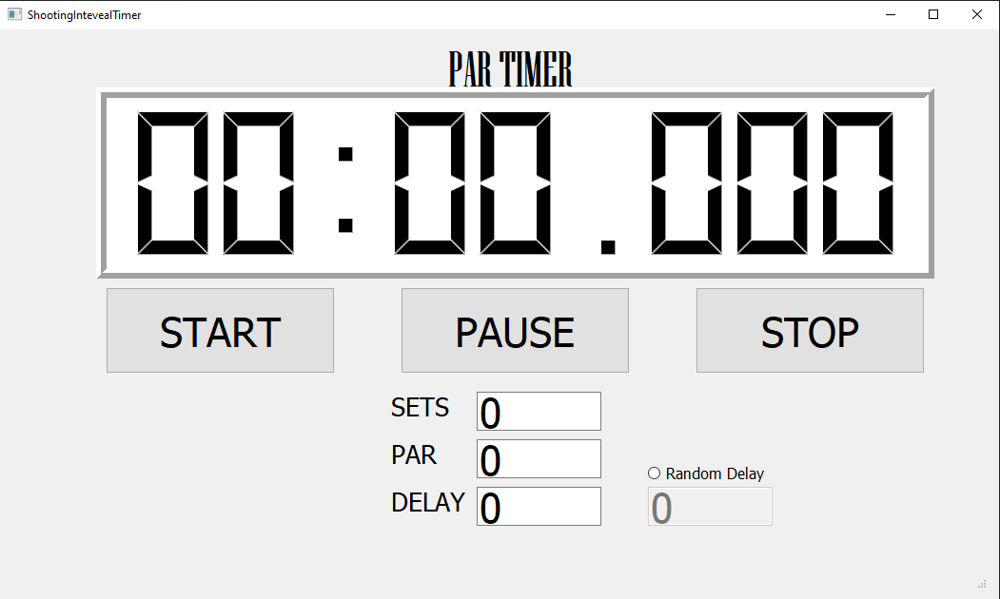

  <h1 align="center">Interval Timer</h1>

- [About The Project](#about-the-project)
- [Usage](#usage)
- [License](#license)
- [Contact](#contact)
- [Acknowledgments](#acknowledgments)

## About The Project

This is python aplication for dryfire training. 

Aplication allow user to set SETS, PAR, DELAY and RANDOM DELAY range. Inform user with sound and timer backlight about work and break time.

(<a href="#readme-top">back to top</a>)

## Usage

Simply run TIMER.exe, and set your parameters. If you leave 0, default parameters are: 10 sets, 3sec PAR time and 3sec DEL time wihout random delay. 

(<a href="#readme-top">back to top</a>)

## License

Distributed under the MIT License. 

(<a href="#readme-top">back to top</a>)

## Contact

Michał Olichwer - [@in/olichwer](https://www.linkedin.com/in/olichwer/) - olichwer.michal@gmail.com

Project Link: [interval-timer/](https://gitlab.com/olichwer.michal/interval-timer/)

(<a href="#readme-top">back to top</a>)

<!-- ACKNOWLEDGMENTS -->

## Acknowledgments

Based on CED7000 Timer

(<a href="#readme-top">back to top</a>)

<!-- MARKDOWN LINKS & IMAGES -->

<!-- https://www.markdownguide.org/basic-syntax/#reference-style-links -->

